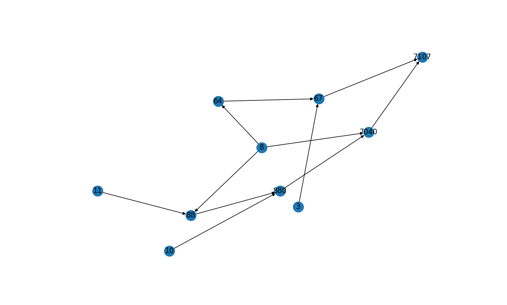
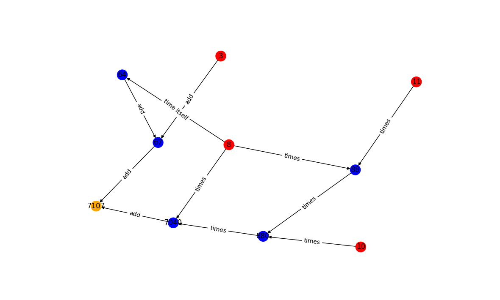

# Introduction

<p align="justify">Automatic Differentiation is able to evaluate real-valued functions of one variable and their derivative exactly. For real-valued functions of more than one variable, AD evaluates the function and its gradient. For multivariable, vector-valued functions, AD evaluates the function and its Jacobian. By extension, AD is also able to evaluate higher order derivatives (and Hessians, etc…). This is an important problem as many algorithms use derivatives of functions (eg Newton method for root finding, BFGS,  gradient descent and stochastic gradient descent…). In particular, AD is intimately linked to backpropagation in Machine Learning (backprop is a special case of AD) which has enabled engineers to train Deep Neural Network to solve a very diverse set of tasks, from image classification to solving PDEs using NNs. Other methods to obtain derivatives of functions include numerical methods and symbolic differentiation, but they are not suitable for Machine Learning. </p>

# Background

Consider a function of interest f. AD computes the evaluation of the function f and of its derivatives at a given point. The key idea is to use the composition of simple functions (called elementary functions) to get to f.

### Composition of elementary functions

As in elementary mathematics, the order of operations is important. In evaluating , the program needs to know to evaluate  first and then add the result (6) to 4 to obtain 10. In a similar fashion, when evaluating a function, eg:


We first need to compute:


then:


ie , then finally:


ie:


Thus, we are composing the elementary functions:


To get:


We can keep track of the composition of such elementary operations with a graph, where nodes represent variables (independent or dependent) and links represent elementary operations.

Similarly, to take the derivative of our function f, we can use the chain rule. As the derivatives of elementary functions are known and easy to compute, we are able to find the derivative of our complicated function f. In particular, we use:


And we use the chain rule: 


We can compose the chain rule multiple times to get f’:


Indeed, 


We can use the following (non-exhaustive) list of elementary functions and derivatives:


| Function    |  Derivative  |   
|-------------|--------------|
|   cos(x)    |  -sin(x)     |  
|   sin(x)    |  cos(x)      |  
|   exp(x)    |  exp(x)      |
|   const     |  0           |
|   ln(x)     |  1/x         |
|   tan(x)    |  sec(x)sec(x)|

### Computational graph

Note that we can also keep track of the calculation of derivatives using a graph structure. For example, the following graph represents the function:


where:


and:


We keep track of the function evaluation and its derivative at   using a table.

Reverse mode AD also uses the chain rule and the computational graph in a similar fashion.


# Installation

Create and activate virtual environment, for example `autodiff-107-env`:
```
$ python3 -m venv autodiff_107-env
```
```
$ source autodiff_107-env/bin/activate
```

make sure to have pip version 21.3.1, older versions might not work
```cmd
$ python3 -m pip install --upgrade pip
```
pip install
```cmd
$ pip install autodiff_107
```
You are now ready to use the package!

### Hosted Docs
> Docs are hosted using github-pages
[Click here](https://jgbrasier.github.io/cs107test/build/html/index.html)


# Tutorials

## Using Variables

Creating a variable is the same as creating a numpy array, in fact our variables are built out of numpy arrays!

````python
import autodiff_107.diff as ad
x = ad.variable([[1,2],[3,4]])
````

To see the numerical value of a variable you have to use the `value` function

```python
>>> ad.value(x)
array([[1, 2],
       [3, 4]])
```

Our variables can be used just like `numpy.ndarray`s! Feel free to use matrix operators as well as numpy mathematical functions but be sure to use our version of numpy which supports operations on our variables.

```python
from autodiff_107.math import numpy as np
```

This version of numpy is almost vanilla but has a few wrapped functions to ensure the computational graph is built during the forward pass. These are the `exp` and `log` functions to different bases:

### Exp and log to a base:

```python
x=variable(3)
y=np.log_base(x,base=3)
z=np.exp_base(x,base=3)
```
```cmd
>>> ad.value(y)
1.0
>>> ad.value(z)
27.0
```

## Forward Mode Tutorial

Like most of our library, forward mode is very simple to use. First we want to import the `diff` module which contains our automatic differentiation implementation and numpy

```python
import autodiff_107.diff as ad
from autodiff_107.math import numpy as np
```


Next we can set up a variable we want to use in our function (or multiple)

```python
x = ad.variable([2,4,5,9])
```

Now we need to set a seed for this variable. By default the seed for all Nodes is 0. We can either set the seed component individually for each input or we can set it for the entire variable (this is probably the best way in most cases)

```python
seed = np.array([0,1,0,0])
ad.set_fm_seed(x, seed)
```

Now, whenever we compute a function with `x`, `f` will automatically have the derivative of itself with respect to `x` and its defined seed. For example we could have the following function

```python
f = x @ x + 3 * x
```

This should square the elements of `x`, add them together, then add 3 times `x`. So we would expect the derivative of `f` with respect to `x` and `seed` to be $2 * 4 + 3$ for the second element and $2*4$ for the rest and indeed, checking `f`s derivative we get

```python
>>> ad.get_fm_derivative(f)
array([ 8., 11.,  8.,  8.])
```

Note that when you set a new seed, you have to recompute `f` as such

```python
>>> ad.set_fm_seed(x, np.array([1,0,0,0]))
>>> f = x @ x + 3 * x
>>> ad.get_fm_derivative(f)
array([7., 4., 4., 4.])
```

This is because the forward pass is only done when `f` is computed so if you didn't recompute, `f` would still have the derivative with respect to the old seed. A cleaner way to do this would be:

```python
>>> f = lambda x: x @ x + 3 * x
>>> ad.set_fm_seed(x, np.array([0,0,1,0]))
>>> ad.get_fm_derivative(f(x))
array([10., 10., 13., 10.])
```

The result is the same but it will be easier to avoid mistakes.

Note that we place no restrictions on the seed passed into `set_fm_seed`, it does not have to sum to one and could have fractions. Usage of this kind would be pretty advanced and anyone looking to use forward mode this way should already know what they are doing.

If you want to check the current seed of a variable use

```python
>>> ad.get_fm_seed(x)
array([0, 0, 1, 0])
```

## Backward Mode Tutorial

Backward Mode is even easier to use than forward mode! The most important thing you have to remember is to wrap your variables in our `variable` function.

```python
import autodiff_107.diff as ad
from autodiff_107.math import numpy as np

x = ad.variable([[1,2],[3,4]])
y = np.array([[3,9],[1,5]])

f = x @ y + y * x
```

The result of this operation is 

```python
>>> ad.value(f)
array([[ 8, 37],
       [16, 67]])
```

As you can see, it is perfectly allowed to mix our variables and normal numpy arrays, and numpy broadcasting and elementwise operations will continue to behave as expected. To get your derivative (or jacobian in this case) simply use our derivative function. Note that the inputs into the derivative function have to be flat (otherwise the jacobian shape would not be well defined). Feel free to flatten them however you wish.

```python

>>> ad.derivative(f.ravel(), x.ravel())
array([[ 6,  1,  0,  0],
       [ 9, 14,  0,  0],
       [ 0,  0,  4,  1],
       [ 0,  0,  9, 10]])
```

Note that using just a subset of inputs/outputs also works

```python
>>> ad.derivative(f[0,0], x[0,0])
array(6)
```

```python
>>> ad.derivative(f[0], x.ravel())
array([[ 6,  1,  0,  0],
       [ 9, 14,  0,  0]])
```

It really is just that simple! Just remember that the inputs to derivatives have to either be our variable objects, or the output of a function that had a variable as its input. For example

```python
# Dont do this
ad.derivative(f.ravel(), y.ravel())
```

would fail, because y is not a variable!

# Software organization

## Directory structure
```
cs107-FinalProject
├── src
|   ├── autodiff_107
|   | 	├── __init__.py
|   |   ├── diff.py
|   |   ├── math.py
│   │   ├── optim.py
|   |   ├── rootfind.py
|   |   └── viz.py
├── tests
|   ├── __init__.py
|   ├── test_Node.py
|   ├── test_nodemath.py
|   ├── test_optimize.py
|   ├── test_rootfinding.py
|   ├── test_viz_basic.py
|   ├── test_viz_expensive.py
|   └── test_viz_reverse.py]
├── docs
│   ├── figs
│   │   └── ...
│   ├── milestone1.md
│   ├── milestone2.md
│   ├── milestone2_progress.md
│   └── documentation.md
├── requirements.txt
├── LICENCE
└── README.md
```
 - `autodiff_107` contains `diff.py`, `math.py`, `optim.py`, `rootfind.py` and `viz.py` modules. `diff` contains Node, our main class for variables. `math` deals with overriding numpy functions for members of Node. `optim` has optimization functions, `rootfind` has rootfinding algorithms. `viz` contains the code for building the visualization of the computational graphs.
 - `docs` contains the source and build code for the Sphinx powered documentation. It generates an HTML page. 
 - `tests` contains our testing suite for all our classes and functions
 - Our License, README and `requirements.txt` are in the base directory.

### A note on our license

As mentioned above, our License can be found in the LICENSE file

<p align="justify">We use the MIT license. It puts very few limitations on what can be done with the code (copy, modify, publish, distribute and even sell) and is compatible with many GNU General Public Licenses. The conditions only require preservations of copyright and license notices. </p>

## Basic modules

<p align="justify">diff.py contains our basic Node class, which we use to represent independent and dependent variables, as well as outputs. Instances of nodes represent variables. math.py is used to overwrite and wrap numpy functions so that we can call them on instances of class Node. </p>

<p align="justify">We have the viz module for visualization of the computational graph. It contains the basic functions to visualize the computational graph as a directed graph. It also contains functions to represent the directed graph with a nice layout. </p>

## Tests

Our tests are in `test_Node.py`, `test_nodemath.py`,  `test_rootfinding.py `, `test_optimize.py`, `test_viz_basic.py`, `test_viz_expensive.py` and `test_viz_reverse.py` . To run them, you can clone our github repo and install the packages present in `requirements.txt`. Then you can run

```python
python3 -m pytest
```
Our test suite is integrated using TravisCI and CodeCov and is reflected with badges.

Alternatively to run the entire test suite, you can just run create a virtual environment and install our package.

Then run:

```python
pip3 install pytest
```

and then

```bash
python3 -m pytest
```

# Implementation details

## Overview

> Here, we explain what happens under the hood. Not everything discussed here is user facing! But this is what is used `derivative` function!

The core data structure for our library is a `Node`, defined in `diff.py`. `Node`s make up the computational graph that we  traverse for forward mode AD as well as for forward and backward passes of reverse mode. They each have a value, a derivative with respect to each parent and a forward mode derivative used to do forward mode. This forward mode derivative is the current derivative of the Node with respect to the inputs and a user defined seed.

`Node`s have overloaded operators (addition, substraction, cos, etc) such that when they are used in a computation, new nodes are created for the result of the operation, and the resulting:


are stored for each intermediate node. We also store the name of the operation that was performed (with `result._operation`). The result of a function is returned as one node that is the descendant of all of the inputs used in that computation.

We store partial derivatives as a dictionary because we need to store the derivative with respect to each parent. This gives us the connections of the computational graph using the keys to this dictionary and is how we do traversal for the backward pass. This is also what we use in the visualization tools.

As mentionned, we had to implement new versions of operators like cos, exp, etc. that operate on Nodes. They also handle setting derivatives and keeping track of the names of the operation. We did this by writing a wrapper for unary numpy functions. Then we defined derivatives for all the functions we wanted to support and used them to wrap the numpy functions such that they would handle Node objects and properly maintain the computational graph.

We  have a `_backward` function in `diff.py` that handles doing the reverse pass on results, and calculating the derivatives of the result with respect to the inputs. We allow passing either a single `Node` or a vector of `Node`s into `_derivative`. This lets us easily handle functions from $\mathbb R^n \rightarrow \mathbb R$ and functions from $\mathbb R^n \rightarrow \mathbb R^m$ . Our user facing derivative function takes `f` and `X` and will output either the derivative of `f` with respect to `X` or a jacobian, depending on the shapes of `f` and `X`. `f` and `X` do have to be flat but the user can flatten their matrices however they like and reshape the output however works best for their use case.

## Forward mode AD

> This aims to explain the backend of forward mode

For forward mode AD, we associate to every instance of node (ie every independent or dependent variable), a seed `self._fmd`. By default, this would be set to 0. Every time we add to nodes together, we correspondingly set the seed of the new node to the sum of the seeds of its parents. This is because if:


then:


or using the notation from lectures:


Likewise, we can use the fact that if:


where  is the partial derivative of f with respect to its first input.

So we can update the seed of every new node - this depends on how we combine the node's parent.

For example, after creating a virtual environment and installing our package, one can import:

```python
from autodiff_107.diff import Node
```


```python
x = Node(3, fm_seed=1/2)
y = Node(7, fm_seed=1/2)
f = x-y
# assert f._fmd == 0
```
This is `test_forward_mode_4` in `test_Node.py`. Here, we see that both x and y have seed 1/2.

## Reverse Mode AD


> This aims to explain the backend of reverse mode


Our reverse mode AD (on `Node`s) is called `_backward`.

For reverse mode AD, we use the chain rule as well as our dictionary to store the partial derivatives of a child with respect to its parents (`self._d`). 

We do a traversal of our computational graph. We first visit every parent of the output, and add these as nodes to visit later (`nodequeue`). We then mark the current node as visited. We then pop elements from `nodequeue` and visit all of their parents, etc... 

By starting from the output and updating the derivate of the output using the chain rule as we go, we can get the partial derivatives of the output with respect to the independent variables (the inputs). For instance (after creating a virtual environment, installing our package and importing Node as above), if: 

```python
x = Node(3)
y = Node(7)
z = x*y
f = z+x
```

Then:


In our code, we start from f (the output is f). Its parents are z and x and we compute:


This is the first thing that would be computed using our reverse mode AD . Note that even though z is a function of x, here we take the partial derivatives of f with respect to z and x by seeing z as a variable of its own.

The parents of z are x and y. Thus we also compute:


Thus, the partial derivative of f with respect to the input x is:


This is the last step of what's happening in our reverse mode example, as the parents of f are z and x, and we already have computed: 


and:


Likewise, the partial derivative of f with respect to the input y is:


If you want a more visual explanation of what's happening, use our visualization tools!

If you want to try the code below, create a virtual environement, import our package and run:

```python
from autodiff_107.diff import Node
from autodiff_107.diff import variable
from autodiff_107.math import numpy as np
```

Note that when we call `_backward ` on the output, we access the partial derivatives of the output with respect to the independent variables as follow:

```python
x=Node(2)
y=3
z=y*x
# assert z._value==3*2
# the partial derivative of z with respect to x is accessed as follows
# assert z._d[x]==3
w=np.exp(z).item()
# assert w._value==np.exp(3*2)
# the partial derivative of w with respect to z is accessed as follows
# assert w._d[z]==np.exp(3*2)
# REVERSE MODE AD
w._backward()
# z._df and x._df represent the derivatives of w wrt to z and x, respectively
assert z._df==np.exp(3*2)
assert x._df==3*np.exp(3*2)
```

this is from `test_backward_1` in `test_nodemath.py`.

We can then use the function `_clear_df` to clear those partial derivatives after `_backward`has been called. For example,

```python
x=Node(2)
y=3
z=y*x
# assert z._value==3*2
# the partial derivative of z with respect to x is accessed as follows
# assert z._d[x]==3
w=np.exp(z).item()
# assert w._value==np.exp(3*2)
# the partial derivative of w with respect to z is accessed as follows
# assert w._d[z]==np.exp(3*2)
f=np.cos(w).item()
# assert f._value==np.cos(np.exp(3*2))
# the partial derivative of f with respect to w is accessed as follows
# assert f._d[w]==-np.sin(np.exp(3*2))
# REVERSE MODE AD
f._backward()
# derivatives of f wrt to w
# assert w._df==-np.sin(np.exp(3*2))
# derivatives of f wrt to z
# assert z._df==-np.sin(np.exp(3*2))*np.exp(3*2)
# derivatives of f wrt to x
# assert x._df==-np.sin(np.exp(3*2))*np.exp(3*2)*3
f._clear_df()
# assert w._df==0
# assert z._df==0
# assert x._df==0
w._backward()
# derivatives of w wrt to z
# assert z._df==np.exp(3*2)
# derivatives of w wrt to x
# assert x._df==3*np.exp(3*2)
```

this is `test_clear_derivative_bis` in `test_nodemath.py`.

## Derivatives

> This is not user facing!

The function `_derivative` computes the derivative of the variables from the class:`Node` with respect to X, where both the variable and X are inputs of the function.

For example,

```python
x=Node(2)
y=3
z=y*x
# assert z._value==3*2
# partial derivative of z with respect to x
# assert z._d[x]==3
w=np.exp(z)
# derivative of w wrt to z
# assert w._derivative(z)==np.exp(3*2)
# derivative of w wrt to x
# assert w._derivative(x)==3*np.exp(3*2)
```

this is `test_derivative_1` in `test_nodemath.py`. If you want to try this code, remember to import the following first:

```python
from autodiff_107.diff import Node
from autodiff_107.diff import variable
from autodiff_107.math import numpy as np
```

## Network Visualisation

We use the package NetworkX (https://networkx.org/).

We have three versions: `draw_graph_without_edge_labels`, `draw_graph` and `draw_graph_expensive`. They all draw a directed graph.

We start by building a directed graph  and we add nodes to this directed graph by first adding all the output nodes.

We then use the same idea as for reverse mode AD to traverse the digraph. For every node already present, we look for its parents and add these as nodes to our graph. Instead of `self._d`, the dictionary of interest is `self._operation` which contains strings with the corresponding elementary operation expressed in word. When we traverse the graph, every time we have a parent-children link, we add this directed edge to out directed graph. We use the dictionary `self._operation` as a way to label our directed edges.

<p align="justify">Depending on the function, we also colour the nodes following the convention: independent variables in red, dependent variables in blue and outputs in orange. This is as easy as checking that the in-degree is zero, that the in-degree and the out-degree are both positive, and that the out-degree is zero, respectively. </p>

We also have a way to visualize reverse mode AD, `draw_reverse_graph`. This supports visualization of multivariate function, but not vector-valued functions. The underlying graph (and the layout!), is the same as the one one get using `draw_graph_expensive`, but the colours are different: the output node is in purple, the dependent variables are in light blue and the independent variables are in grey. The value which we use to label the grey nodes are the partial derivative of the output witht repsect to each dependent variable (input). The label of edges correpsond to the partial derivative of a child with respect to its parents. For more details, check out the examples below!

# Extensions

## Reverse mode AD

We have implemented reverse mode automatic differentiation. This is more efficient than forward mode for some functions (multivariate functions with one output, for example, and more generally, functions of the form:


it might also be true for functions of the form:

depending on wether m>>for some n).

For functions of the form:

reverse mode AD is a two pass process, as opposed to the m-pass forward mode. Reverse mode computes the sensitivity with respect to the independent and intermediate variables. 

<p align="justify">Thus, compared to the forward mode, the reverse mode has a significantly smaller arithmetic operation count for functions of the form:</p>


<p align="justify"> if m is very large. Artificial neural networks have exactly this property: this is one of the reason we implemented reverse mode AD, as we want to train a neural network using our package! </p>

The way we do this is to traverse the computational graph in reverse, starting from the output. Along the way, we keep track of the partial derivatives of children with respect to their parents and build back the partial derivatives of the output with respect to the inputs using the chain rule.

## Optimization suite and root finding algorithms


Using our AD package, we can implement optimization algorithms that use gradient (and also Jacobians!). We implemented a few.

If you want to try these out, create a virtual environment, install our package and import:

```python
from autodiff_107.rootfind import newton
from autodiff_107.math import numpy as np
from autodiff_107.optim import gradient_descent, adagrad
```


### Newton

In `rootfind.py`, we implemented Newton's root finding algorithm for functions:


This is the algorithm for which we start with  and:


This is all we do in our code in `rootfind.py`:

> Please do not try to run this code, we just explain what is going on here!

```python
# maxiter is 50 by default, and tol is 1e-5 by default. 
# Do check that the algorithm terminates because 
# you found the root and not because you reached
# the maximum number of iterations!
xn = variable(x0)
count = 0
while np.abs(value(xn)) > tol and count<maxiter:
    func = f(xn)
    # computes the gradient
    grad = derivative(func, xn)
    # update
    xn = xn - value(func/grad)
    count += 1
```

We can use it to find the root of -3x+4, for example by starting at a starting value of 1. This is `test_newton_1` in `test_rootfinding.py`. 

> You can run this code!

```python
# find root of -3x+4 which happens at 4/3
x0 = 1.
f = lambda x: -3*x+4
tol = 1e-5
x_root = newton(f, x0, tol)
target = 4/3
# We can check that the root we get is close to 4/3:
assert np.isclose(x_root, target, atol=tol)
```

### Gradient descent algorithms

We also implemented gradient descent. This is an algorithm used to find the minimum of a function. The idea of gradient descent for functions:


is to start with a value  and to update:


for some alpha.

More generally, for functions:


In one dimension, here is an example. We are dealing with a univariate function:


The minimum of  is 3 at .

The code can be found in `test_optimize.py` as `test_gradient_descent_1`.

> Please do not try to run this code, we just explain what is going on here!

```python
# find min of (x-3)**2+3, which occurs at 3 with value 3
x0 = 1
f = lambda x: (x-3)**2+3
alpha=.1
max_iter=1000
x_min = gradient_descent(f, x0,alpha, max_iter)
target = 3
assert np.isclose(x_min, target, atol=1e-16)
```

This also works for multivariate functions. Let us consider:


The code can be found in `test_optimize.py` as `test_gradient_descent_2`. The minimum of this function is 3 at , .

> You can run this code!

```python
x0 = [1, 2]
f = lambda x: x[0]**2 + x[1]**2 + 3
alpha=.1
max_iter=1000
x_min = gradient_descent(f, x0,alpha, max_iter)
target = np.array([0., 0.])
assert np.isclose(x_min, target, atol=1e-16).all()
```

### Adagrad

The adaptive gradient algorithm is an stochastic gradient descent (SGD) variation. It aims to combat the pitfall of gradient descent which is having a fixed learning rate. The idea behind Adagrad is to have different learning rates for each parameter based on iteration:
<a href="https://www.codecogs.com/eqnedit.php?latex=\mathrm{SGD}&space;\Rightarrow&space;\mathrm{x}_{\mathrm{t}}=\mathrm{x}_{\mathrm{t}-1}-\alpha&space;\frac{\partial&space;\mathrm{f}}{\partial&space;\mathrm{x}_{\mathrm{t}-1}}" target="_blank"></a>


where:


Using the same mulitvariate example as above, code is found in `test_optimize.py` as `test_adagrad_1`
```python
x0 = [1.1, 0.9]
f = lambda x: 0.1*x[0]**2 + 2*x[1]**2 + 3
x_min = adagrad(f, x0)
target = np.array([0., 0.])
assert np.isclose(x_min, target, atol=1e-10).all()
```

## NetworkX visualization of the computational graph

These  functions are useful to visualize the computational graph. They can be used by users using the user-facing variable. All the visualization function also work with instances of Node. Thic can be useful for developpers. 

After creating a virtual environment and importing our package using pip, you can create a file and import the following:

```python
from autodiff_107.diff import Node
from autodiff_107.diff import variable
from autodiff_107.math import numpy as np
from autodiff_107.viz import draw_graph_without_edge_labels
from autodiff_107.viz import draw_graph
from autodiff_107.viz import draw_graph_expensive
from autodiff_107.viz import draw_reverse_graph
```

You will then be ready to use the visualization tools using the code we provide below. 

<p align="justify"> We use NetworkX to visualize the computational graph. This works for functions of the form: </p>


### Basic version

<p align="justify">This version makes a directed graph where nodes are variables (independent and intermediate, plus the output). Edges between nodes represent parent-child relations. This is a "light" version, that is why it's so simple. </p>

Here is an example created the basic function, called draw_graph_without_edge_labels (that can also be found in test_viz_basic.py as test_viz_a3; if you want to reproduce it, set draw_=True).

```python
x = variable(8)
y = variable(3)
z = variable(11)
w = variable(10)
f = x*x+y+z*x*w*x
draw_graph_without_edge_labels(f)
```

<p align="justify">As we mentionned above, we could have used Node all the same (that can also be found in test_viz_basic.py as test_viz_3; if you want to reproduce it, set draw_=True). For the next example, we will jsut provide the code using variable. </p>

```python
x = Node(8)
y = Node(3)
z = Node(11)
w = Node(10)
f = x*x+y+z*x*w*x
draw_graph_without_edge_labels(f)
```



We see that edges start from child to parents. The final node is the node with out-degree that is zero. That is the node with value 7107.

### Directed graph with colours

This is a bit better than the basic version: this is a directed graph, where edges point from parent to child, as before. In addition, the independent variables are in red and the the intermediate variables are in blue. The output is in orange.

<p align="justify">Here is an example of the directed graph created using draw_graph. Note that the layout is chosen by NetworkX. Again, this code can also be found in test_viz_basic.py as test_viz_a4; if you want to reproduce it, set draw_=True. </p>

```python
x = variable(8)
y = variable(3)
z = variable(11)
w = variable(10)
f = x*x+y+z*x*w*x
draw_graph(f)
```



### Full version

<p align="justify">This is the same as the above, but we specify explicitly the layout of the nodes for clarity. All the independent variables, in red, have the same x-coordinate. All the output values, in orange, have the same x-coordinate.  All dependent variables, in blue, have x-coordinates comprised between the x-coordinate of the independent variables and the x-coordinate of the outputs.  </p>

Here is an example of a directed graph created using draw_graph_expensive. This can be reproduced by using test_viz_a3 in test_viz_expensive.py (just set draw_=True when calling the function).

```python
x = variable(8)
y = variable(3)
z = variable(11)
w = variable(10)
f = x*x+y+z*x*w*x
draw_graph_expensive(f)
```


### Vector valued functions

The really cool thing is that all three visualization tools work for multi-valued, multivariate functions, ie:


This can be found in test_viz_expensive.py as test_viz_a4 (just set draw_=True when calling the function).

```python
x = variable(8)
y = variable(3)
z = variable(11)
w = variable(10)
fi=z*x*w*x
f1 = x*x+y+fi
f2=fi+w
draw_graph_expensive([f1,f2])
```


Of course, this works with the sin function, the cos function, etc...

The following example can be found in test_viz_expensive.py as test_viz_a5 (just set draw_=True when calling the function).

```python
x = variable(8)
y = variable(0)
z = variable(11)
w = variable(10)
fi=z*x*x
f1 = x+np.cos(fi)
f2=fi+w
f3=np.sin(y)
draw_graph_expensive([f1,f2,f3])
```


## NetworkX visualization of reverse mode AD

These functions again work with the user facing variable or with Node.

### A simple example

<p align="justify">We also implemented a tool that is similar to the one we used in one of the homeworks. This allows one to track the partial derivatives of the output node with respect to its parents, and then in turn keeps track of the partial derivative of each child with respect to its parents. In this way, it is possible to fund the partial derivative of the output node with respect to the input node. </p>

<p align="justify">In our visualization tool, the output node is always in purple, and the input nodes (aka the independent variables) are always in grey. The dependent variables are always in light blue. The edges are directed, and the direction of the edge is reverse compared to the corresponding computational graph. </p>

Let us start with a basic example. First, we will visualize the computational graph for the problem we consider (this is test_viz_a6 in test_viz_expensive.py, just set draw_=True when calling the function).

```python
x=variable(1)
y=variable(2)
f=x+x*y
draw_graph_expensive(f)
```


This is simple enough. We are dealing with the function:


and we compute:


Note that:


This is test_reverse_a1 in test_viz_reverse.py (just set draw_=True when calling the function):

```python
x=variable(1)
y=variable(2)
f=x+x*y
draw_reverse_graph(f)
```


The way to read this graph is to start from the output node, that is the purple node. It is labelled Final node. What we want to find is the partial derivative of this node with respect to  and with respect to . In our package, the output node which we can call  (to keep the conventions one uses when dealing with the computational graph) has two parents,  wich we can call  (and call ) and  which we call . The partial derivative of with respect to  is 1 and the partial derivative of  with respect to  is 1 because . That is why the blue node has a value of 1:


Then, the partial derivative of  with respect to  is 2 because:


 Similarly,


Now, we use the chain rule:


Note that here we view  as a function of  and .

That is why we multiply the value of the blue node, 1, which is:

 

by 1 (which is now the label on the edge to ), which is:

 

This is the value of the grey node that represents :


Similarly, 


Note that here we view  as a function of  and , even though  is a function of  itself. That is why we multiply the value of the blue node, 1, which is:

 

 by 2 - which is also the label of the corresponding edge and which is:

 

and we add 1, which is:

 

to get:


### A more interesting example

This is test_viz_a7 in test_viz_expensive.py, just set draw_=True when calling the function.

```python
x=variable(1)
y=variable(2)
z=variable(0)
f=x+x*y+z*x+z
draw_graph_expensive(f)
```


We are dealing with the function:


Note that:


Let us use our tool for this. This is test_reverse_a2 in test_vix_reverse.py (just set draw_=True when calling the function).

```python
x=variable(1)
y=variable(2)
z=variable(0)
f=x+x*y+z*x+z
draw_reverse_graph(f)
```


We have:


We won't detail the whole graph as it involves a lot of computation, but let us focus on:


which we know to be:


We use:


Then:


(which is why the edge from the Final node to the grey node with value 2 is labeled with a +1).

And:


which gives the desired result.

### Multivariate, vector-valued function

> This is not user facing. We leave the possibility to call draw_reverse_graph on an array of nodes to show the power of the function and how it could easily be generalized. 

<p align="justify">This is not supported. Be wary when calling the function draw_reverse_graph on an array of node, as the resulting graph corresponds to the result of multiplying the Jacobian of the function under consideration by a vector of ones. For the interested reader, this is added to warning.md. </p>

# Future 

## Adding more optimization algorithms

<p align="justify">Right now only gradient descent and adagrad are implemented. One could also implement further gradient descent algorithms such as SGD (Stochastic Gradient Descent), ADAM, RMS Prop etc.


## Training an Artificial Neural Network (ANN) using our package

<p align="justify">With our optimization algortihms we could train a neural network using our package. This would probably be a very small network, trained on MNIST. We would thus also need to implement the sigmoid function and the rely function.


## Future direction for visualization

<p align="justify">We could make nice visualization as gifs easily using our visualization tools. Furthermore, one could also easily create a table to show the independent and dependent variables along the tangent trace, as we have done in class. </p>


