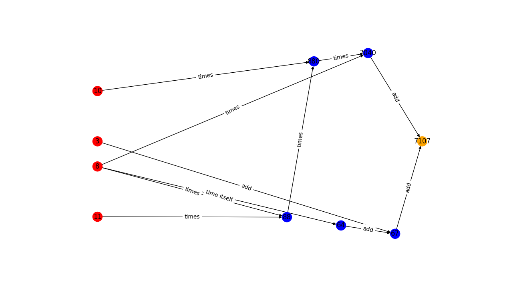

Computational graph visulization
================================

These  functions are useful to visualize the computational graph. They can be used by users using the user-facing variable. All the visualization function also work with instances of Node. This can be useful for developpers. 

After creating a virtual environment and importing our package using pip, you can create a file and import the following:

.. code-block:: python3

    from autodiff_107.diff import Node
    from autodiff_107.diff import variable
    from autodiff_107.math import numpy as np
    from autodiff_107.viz import draw_graph_without_edge_labels
    from autodiff_107.viz import draw_graph
    from autodiff_107.viz import draw_graph_expensive
    from autodiff_107.viz import draw_reverse_graph

You will then be ready to use the visualization tools using the code we provide below. We use NetworkX to visualize the computational graph. 

**Light graph**

This version makes a directed graph where nodes are variables (independent and intermediate, plus the output). Edges between nodes represent parent-child relations. This is a "light" version, that is why it's so simple.

.. code-block:: python3

    x = variable(8)
    y = variable(3)
    z = variable(11)
    w = variable(10)
    f = x*x+y+z*x*w*x
    draw_graph_without_edge_labels(f)

.. image:: ../figs/Figure_3.png
    :width: 600
    :alt: simple comp graph

**Directed graphs with colors:**

This is a bit better than the basic version: this is a directed graph, where edges point from parent to child, as before. In addition, the independent variables are in red and the the intermediate variables are in blue. The output is in orange.

.. code-block:: python3

    x = variable(8)
    y = variable(3)
    z = variable(11)
    w = variable(10)
    f = x*x+y+z*x*w*x
    draw_graph(f)

.. image:: ../figs/Figure_2.png
    :width: 600
    :alt: simple comp graph

**Pretty directed graphs with colors:**

This is the same as the above, but we specify explicitly the layout of the nodes for clarity. All the independent variables, in red, have the same x-coordinate. All the output values, in orange, have the same x-coordinate. All dependent variables, in blue, have x-coordinates comprised between the x-coordinate of the independent variables and the x-coordinate of the outputs. The really cool thing is that all three visualization tools work for multi-valued, multivariate functions

.. code-block:: python3

    x = variable(8)
    y = variable(3)
    z = variable(11)
    w = variable(10)
    fi=z*x*w*x
    f1 = x*x+y+fi
    f2=fi+w
    draw_graph_expensive([f1,f2])

