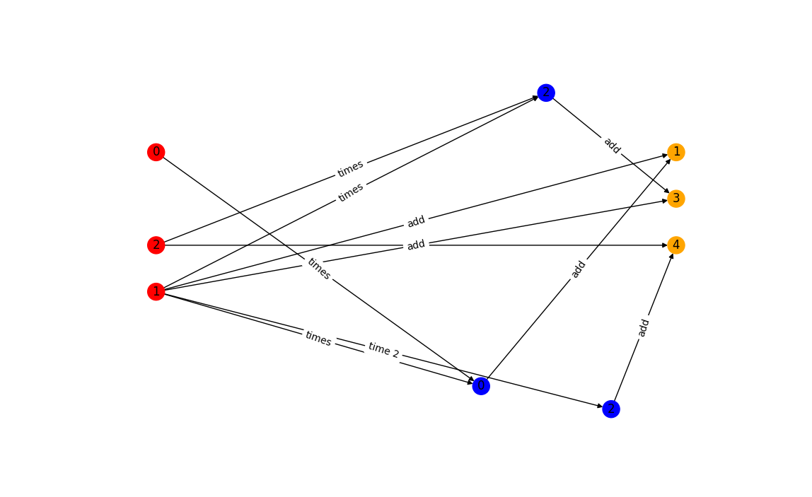
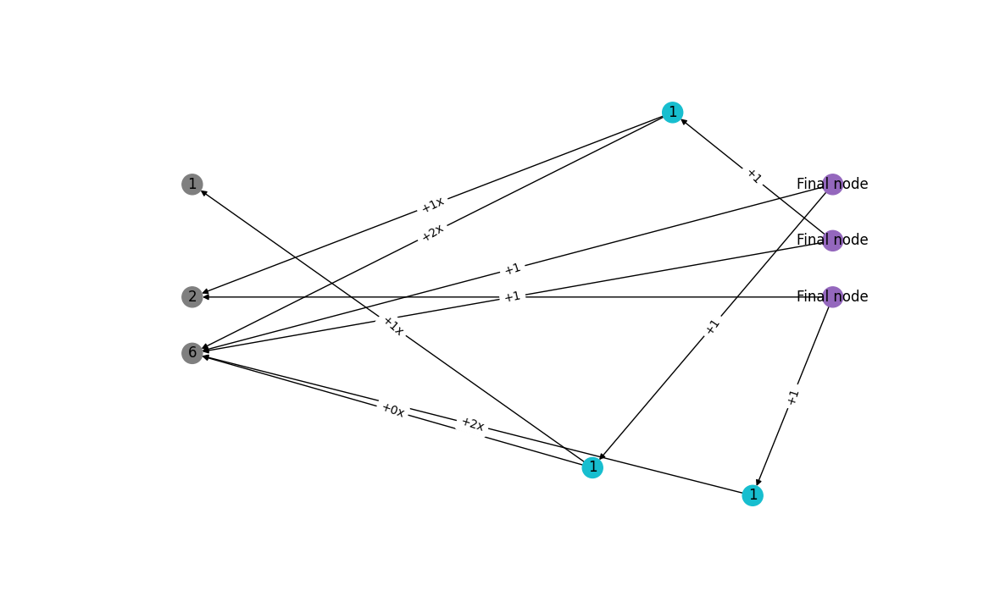

### Multivariate, vector-valued function

This is not supported. Be wary when calling the function draw_graph_expensive on an array of node, as the resulting graph corresponds to the result of multiplying the Jacobian of the function under consideration by a vector of ones. 

Consider the function:


Then:


Let us vizualise this.

This is test_viz_a8 in test_viz_expensive.py, just set draw_=True when calling the function if you want to reproduce it.

```python
x=variable(1)
y=variable(2)
z=variable(0)
f1=x+x+y
f2=x*y+x 
f3=x*z+x
draw_graph_expensive([f1, f2, f3])
```



Calling draw_reverse_graph for the function f returns a graph that corresponds to:


This is test_reverse_a3 in test_vix_reverse.py (just set draw_=True when calling the function).

```python
x=variable(1)
y=variable(2)
z=variable(0)
f1=x+x+y
f2=x*y+x 
f3=x*z+x
draw_reverse_graph([f1, f2, f3])
```




